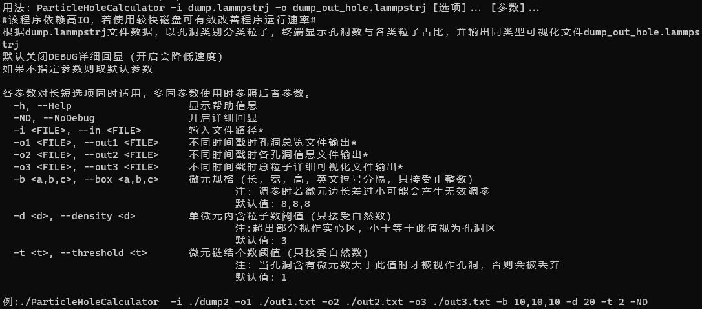

# ParticleHoleCalculator

用于水蒸汽分子群的孔洞识别算法，支持孔洞可视化（OVITO）

## 使用方法

用法：ParticleHoleCalculator -i dump.lammpstrj -o dump_out_hole.lammpstrj [选项]... [参数]...

*# 该程序依赖高IO，若使用较快磁盘可有效改善程序运行速率 #*

根据dump.lammpstrj文件数据，以孔洞类别分类粒子，终端显示孔洞数与各类粒子占比，并输出同类型可视化文件dump_out_hole.lammpstrj

默认关闭DEBUG详细回显（开启会降低速度）

如果不指定参数则取默认参数

```bash

各参数对长短选项同时适用，多同参数使用时参照后者参数。
  -h, --Help                    显示帮助信息
  -ND, --NoDebug                开启详细回显
  -i <FILE>, --in <FILE>        输入文件路径*
  -o1 <FILE>, --out1 <FILE>     不同时间戳时孔洞总览文件输出*
  -o2 <FILE>, --out2 <FILE>     不同时间戳时各孔洞信息文件输出*
  -o3 <FILE>, --out3 <FILE>     不同时间戳时总粒子详细可视化文件输出*
  -b <a,b,c>, --box <a,b,c>     微元规格（长，宽，高，英文逗号分隔，只接受正整数）
                                        注：调参时若微元边长差过小可能会产生无效调参
                                        默认值：8,8,8
  -d <d>, --density <d>         单微元内含粒子数阈值（只接受自然数）
                                        注:超出部分视作实心区，小于等于此值视为孔洞区
                                        默认值：3
  -t <t>, --threshold <t>       微元链结个数阈值（只接受自然数）
                                        注：当孔洞含有微元数大于此值时才被视作孔洞，否则会被丢弃
                                        默认值：1

例:./ParticleHoleCalculator  -i ./dump2 -o1 ./out1.txt -o2 ./out2.txt -o3 ./out3.txt -b 10,10,10 -d 20 -t 2 -ND```

```


